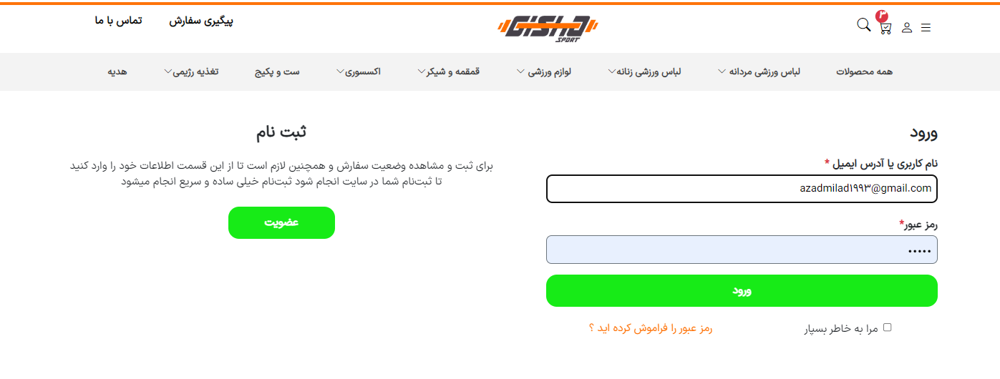
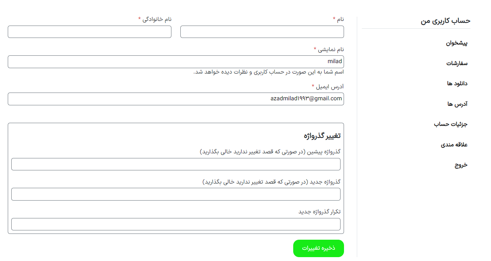

<div id='top' align="center">

An E-commerce site template, implemented with **React.js** and Styled with **Bootstrap**. This is one of my portfolios, but I would be pleased if these codes helped others, so I published it as an open-source project. feel free to explore it, and if you need help, ask me. I would respond as soon as possible.
<p>To support me, please create <strong>Pull request</strong> and give <strong>star⭐</strong> to this repository.<br/>
   I appreciate your support in advance. ❤</p>

</div>

## ✨Demo
<table>
  <tr>
    <td valign="top"></td>
    <td valign="top"></td>
  </tr>
</table>

<table>
  <tr>
    <td valign="top"></td>
    <td valign="top"></td>
  </tr>
</table>

<table>
  <tr>
    <td valign="top"></td>
    <td valign="top"></td>
  </tr>
</table>

<table>
  <tr>
    <td valign="top"></td>
    <td valign="top"></td>
  </tr>
</table>

## 🔧Technologies
* React.js
* Bootstrap 
* Redux Toolkit
* Swiper 
* Formik
* Yup

## 🔥Features
* Using Redux toolkit as state manager
* Using Strapi headless CMS as database
* Fully responsive
* authentication vs authorization
* Diverse sliders

## 📃Pages
* Main (index)
* Products List
* Product Details
* Cart
* Favorites
* Profile
* Contact us
* Cooperation
* Help
* Installment
* MajorShopping
* Privacy
* ShakerPrinting
* Terms
* TrackOrder
* 404 Error(not found)

## 🚀Getting Started
1. Clone the project

  ```bash
  git clone https://github.com/MahmoudAzad/sports-shop-ReactJs.git
  ```

2. Install dependencies
  ```bash
  npm install
  ```

3. start development server
  ```bash
  npm start
  ```

## 🤝Contributing

Contributions are what make the open source community such an amazing place to learn, inspire, and create. Any contributions you make are **greatly appreciated**.

If you have a suggestion that would make this better, please fork the repo and create a pull request. You can also simply open an issue with the tag "enhancement".
Don't forget to give the project a star! Thanks again!

1. Fork the Project
2. Create your Feature Branch (`git checkout -b feature/AmazingFeature`)
3. Commit your Changes (`git commit -m 'Add some AmazingFeature'`)
4. Push to the Branch (`git push origin feature/AmazingFeature`)
5. Open a Pull Request


## 💬Contact Me
  <p>
    <a href="https://linkedin.com/in/mahmoud-azad"></a>
    <a href="mailto:azadmilad1993@gmail.com"></a>
  </p>
  
  <hr/>
  
  <p align="right">(<a href="#top">BACK TO TOP🔝</a>)</p>
